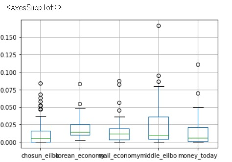
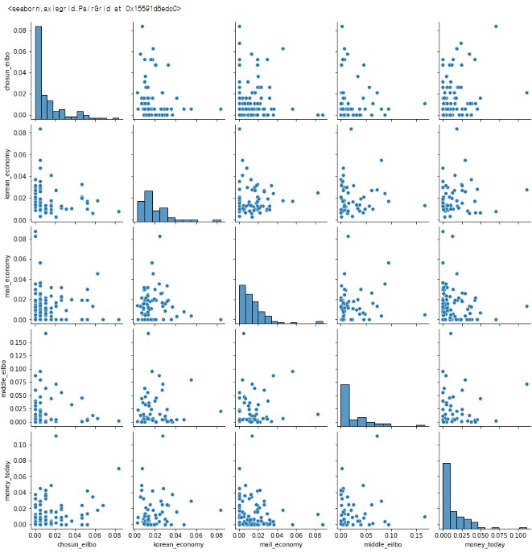

# bigdata_thunder

## 프로젝트 목표 및 설명
안녕하세요. 메가스터디 학원에서 프로젝트를 한 계기로 Text mining을 통해 TF-IDF를 이용하여서 수치화를 시킨다음 사람들이 사용하는 키워드들을 워드클라우드를 시각화로 나타냅니다.

## 프로젝트 과정 설명
1. **네이버 뉴스 크롤링하기** 
   - 특정 표본을 이용하여 추출하기
   - 함수 만들어서 데이터 추출하기
   - 신문 회사에 대한 데이터 프레임 생성하기
   - CSV로 저장하기 
2. **Youtube API 이용하여 크롤링하기** 
   - 댓글 데이터 수집하기
   - 댓글내용, 댓글출시된 날짜, 유튜브의 제목, 채널 이름, 출시된 영상날짜 추출하기
   - 데이터 프레임 생성하기 
3. **전체 표본 이용하여서 tf-idf 데이터 유사도 추출하기** 
   - 신문 데이터 유사도 측정하기
   - COS-SIMILARITY의 데이터프레임 만들기 
4. **데이터 유사도를 통해 시각화 추출하기** 
  - boxplot 시각화하기 
  
  - 산포도 시각화하기 
  
6. **결론** 
이를 통해서 5개의 신문사들의 제목 -내용 유사도를 분석한 결과 0보다 큰 비율은 나타냈지만, 거의 약 0.001이상의 비율로 유사도가 측정된 것을 확인할 수 있었습니다. 그리고, 워드클라우드와 산포도 시각화 분석한 결과 비율로도 겹치는 분야도 있지만, 제목에 없는 내용의 요소들이 가득있으면서, 이를 통해 TF-IDF는 원래 단어 요소들의 개수를 파악하는 기법이기 땜에 그에 대해서 영향을 미치면서 0.001이상의 비율로 측정되었다는 것을 알게 되었습니다. 제목과 내용의 유사성의 동일은 0.001이상이 되어야지 거의 유사한 것을 확인할 수 있어서.. 참 내용 처리를 하는데 완벽하게 비슷한 용어들을 다 같은 용어로 취급 처리하기가 어렵다는 한계점이 도달한다는 것을 알 수 있습니다. 그리고, 지금 이 분석도 표본적으로 추출한 데이터들을 매개로 한 것이기 때문에.. 10000개의 데이터들을 분석하는데에 있어 너무 코드 부팅 시간이 한 언론사를 하는데 하루가 넘어갈 정도의 양들을 진행되면서 오류가 나기 시작하면서 분석 오류가 나게되어서 예외처리를 하였지만, 이도 막지 못했다는 오류적 한계도 있었다는 것을 확인 할 수 있었습니다. 제목 - 내용 신뢰도의 분석을 하면서 여러 용어들을 많이 쓰는 내용들의 단어 요소들과 제목의 요소들이 비슷하게 쓰이는 것도 있지만, 더 추가되거나 다르게 쓰이는 단어들도 많이 있어서 여러 사람들의 쓰이는 단어들이 다양하다라는 것을 확실히 알아볼 수 있습니다. 
7. **향후 연구** 
프로그래밍을 하는데 제목 내용의 유사도를 구하는데 10000개 이상의 url 데이터들을 한꺼번에 추출하는데 하루 넘게 부팅 중이어서 추출하는데 어려움이 있었고, 결국 100개의 표본을 추출해야지 url에서 나온 내용들을 추출할 수가 있었습니다. 그리고, 제목과 내용의 유사도를 구하는데, 한글의 단어가 그만큼 뜻과 동의어, 반의어의 요소들이 복잡하다는 것을 느끼게 되어서 유사도의 비율이 가설만큼 안나온 결과가 나오게 되었다는 점이었다고 생각합니다. 그리고, 한글을 추출하는데, 한글 제목이 있는데, 영어로 된 내용으로 분석이 되어 있어서 이를 고려하지 못한 채 데이터들을 tf-idf하는 과정에서 유사도가 0이 나온 경우도 결과가 나오게 되었습니다. 그래서, 전체적으로 데이터를 추출을 못하고, 표본적으로 소수의 데이터만 추출하는 과정을 코드로 했다는 점이 아쉬웠습니다. 
8. **참고 문헌** 
데이터들을 분석하는 데에 있어서 단어 전처리를 하는 자연어 처리를 할 수 있는 오픈소스를 매개로 추출하였습니다. Github을 이용해서 소스 파일들을 모듈화하고, 이를 활용하여서 뉴스 데이터의 분석에 쓰게 되었습니다. (오픈소스 출처: [tensorflow](https://github.com/ukairia777/tensorflow-nlp-tutorial)) 
